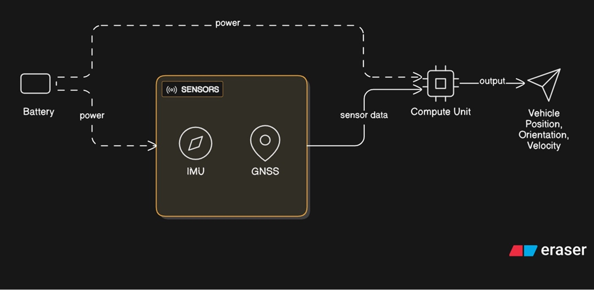
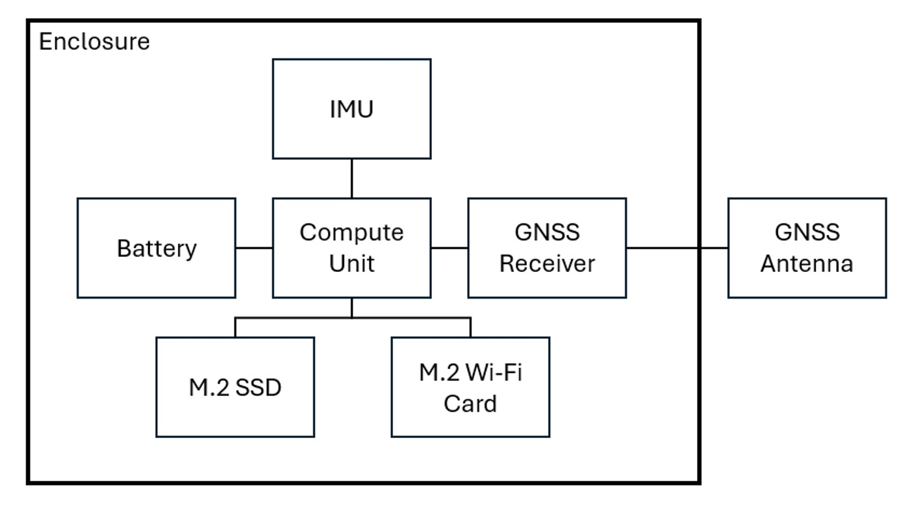
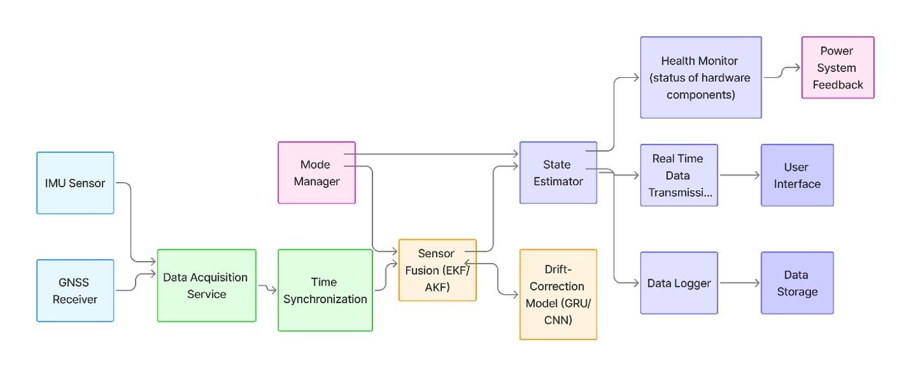
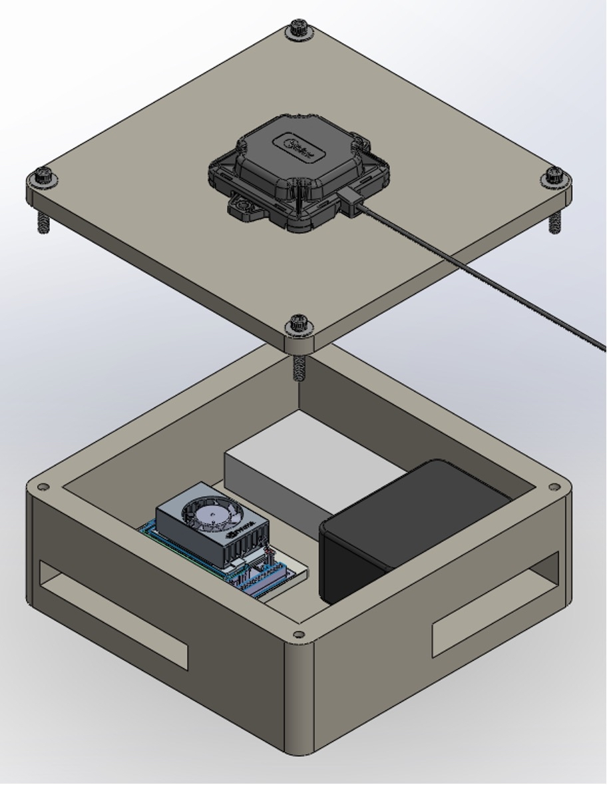

[← Back to Portfolio](../../)

# AI for Robust Navigation Solutions
**Machine learning–assisted localization to reduce navigation drift in autonomous systems**

## Overview
This senior design project explores the use of machine learning to improve navigation robustness in autonomous robots operating under sensor noise and drift. Modern navigation systems rely significantly on a Global Navigation Satellite System (GNSS) for localization. In a world with GNSS-incompatible areas and bad actors using spoofing techniques to deny GNSS service, it is crucial to have an alternative reliable navigation method. Inertial measurement units (IMUs) attempt to fill this alternative navigation role as they utilize proprioceptive sensors for localizing, which do not rely on data from the environment, making them useful in GNSS-incompatible areas. However, IMUs are susceptible to accumulated error as they integrate noisy and biased data (acceleration and angular velocity) to get position and orientation. Over long trajectories, even small errors can lead to significant localization drift, reducing navigation accuracy and system performance. The goal of this project is to augment classical navigation pipelines with a learning-based correction approach to improve pose estimation stability and overall system reliability.

## Technical Approach
- Created a multi-sensor system using IMU, GNSS, and wheel odometry data
- Developed a data pipeline to preprocess and synchronize sensor measurements
- Implemented a machine learning model (AKF-GRU hybrid) to estimate and correct localization drift
- Compared learning-assisted pose estimates against baseline (GNSS)
- Evaluated performance under varying noise conditions and motion profiles

## Results & Validation
- Demonstrated improved pose stability over extended trajectories
- Reduced drift accumulation compared to traditional IMU-only approaches
- Validated feasibility of incorporating learning-based correction into an autonomous navigation pipeline
- Identified scenarios where AI-assisted localization provided the greatest benefit

## Visuals

*High-level system architecture illustrating sensor inputs, learning-based correction, and navigation output.*

*Hardware architecture diagram illustrating physical integration and enclosure.*

*Software architecture diagram illustrating data flows and processing.*

*Isometric view of the CAD model with components (open).*

## Tools & Skills
**Tools:** SolidWorks, MATLAB, Python, PyTorch  
**Skills:** Sensor fusion, machine learning integration, system evaluation, autonomous navigation

## My Role
I contributed to system and hardware architecture design, sensor data processing, model integration, simulation, and deployment. I collaborated with a multidisciplinary team to define success metrics, analyze results, and iterate on the navigation approach based on experimental findings.

---
[← Back to Portfolio](../../)

